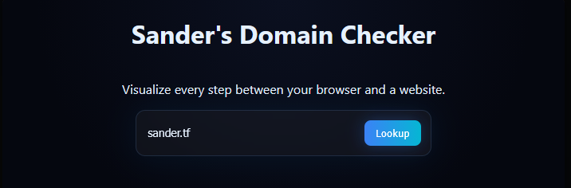
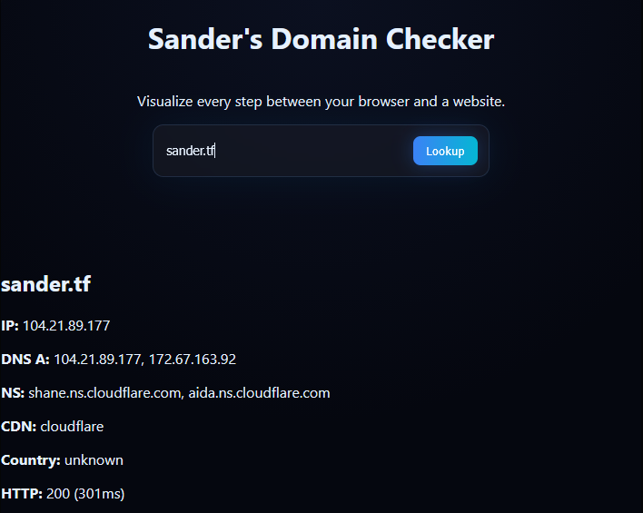

# Domain Info

<p align="center">
    
</p>

<p align="center">
    Visualize every step between your browser and a website.
</p>

<p align="center">
  
  
</p>

---

## Features

- Domain Checks

--- 
## Preview



---

## Tech Stack
- HTML
- SCSS
- TS
- JS

--- 

## Installation

```bash
git clone https://github.com/sanderhd/domain-checker.git
cd domain-checker

vercel
```